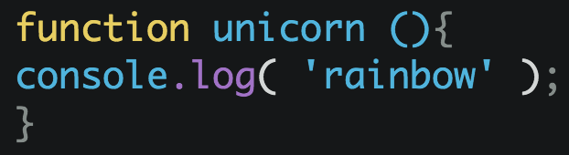

# esformatter

> Beautify JavaScript using [esformatter](https://github.com/millermedeiros/esformatter)



*Issues with the output should be reported on the esformatter [issue tracker](https://github.com/millermedeiros/esformatter/issues).*


## Install

```
$ apm install esformatter
```

Or, Settings → Install → Search for `esformatter`


## Usage

Open the Command Palette and type `esformatter`.

Can also be run on just a selection. For example the code in a `<script>` tag.

There's a `Format On Save` option in the settings.


## Info

This plugin will first try to import the `esformatter` dependency in your project. If one can't be found, it will fall back to the bundled one with the following [plugins](package.json) *(PR welcome for more)*.


## Config

Add the plugins you want to your [config file](https://github.com/millermedeiros/esformatter#configuration):

```json
{
	"plugins": [
		"esformatter-braces"
	]
}
```


## Keyboard shortcut

Set the keyboard shortcut you want in your [keymap](http://flight-manual.atom.io/using-atom/sections/basic-customization/#customizing-keybindings):

```cson
'atom-text-editor':
	'cmd-shift-x': 'esformatter'
```


## License

MIT © [Sindre Sorhus](https://sindresorhus.com)
